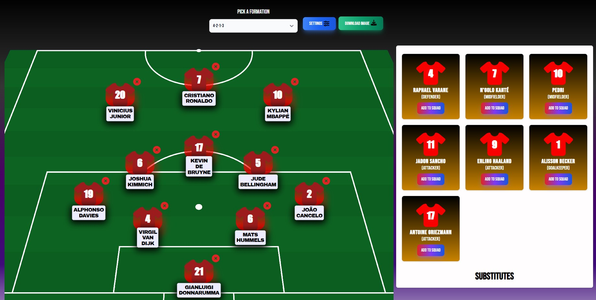
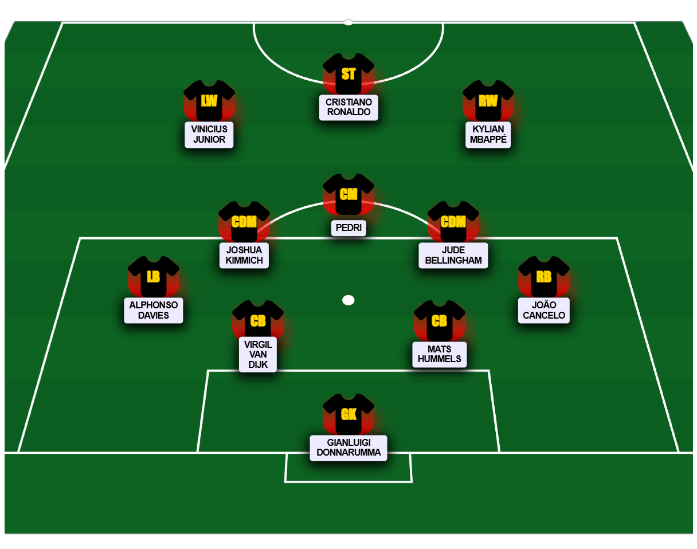
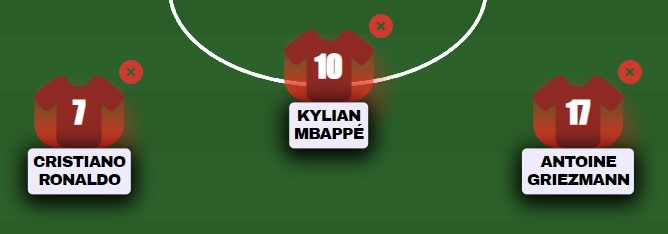
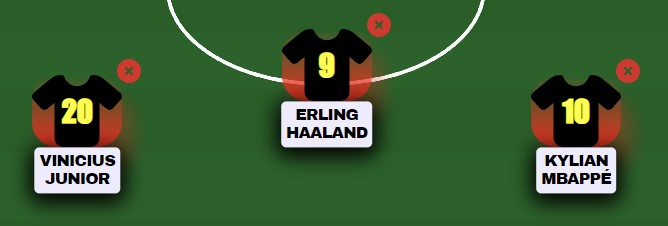
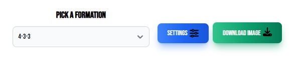
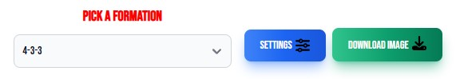

# Pitch Invader

## About the library
The **"pitch-invader"** library simplifies the creation of a football starting XI. It offers a pitch featuring players and a bench. Users can easily add or swap players on the pitch. Simply include the component and define the players, the component handles the rest. *The library is responsive, which means it also works properly on mobile devices.*

## The library provides:
* various formations,
* customizable jersey color,
* customizable jersey text color,
* customizable jersey text,
* saving of the starting XI as an image,
* easy to add additional translations




## **Important Details**
### Define the players

You can define players as TypeScript interface:
```typescript
interface Player {
    id: number;                      // Id of the player, has to be unique
    positionType: PositionType;      // The type of the player's position
                                    // ('goalkeeper' | 'defender' | 'midfielder' | 'attacker')
    alternativePositions: string;    // additional positions can be listed separated by ", "/" or ";"
    name: string;
    shirtNumber: number;
}
```
<hr>

### **About Positions**
There are *4 types* of positions defined in the `PositionType` type: 
1. goalkeeper
2. defender
3. midfielder
4. attacker

**positionType** must be one of the four above, this will be showed as the player's position.

There are players in the world of football who can be used in different areas of the field, such as Joshua Kimmich. In this case, we would probably like to be able to put him in several areas of the pitch. This can be done with "**alternativePositions**", where you can list even more of the 4 position types just listed, separated by ",", "/" or ";". For example: 
```typescript
const player: Player = {
    id: 1,
    positionType: "defender",
    alternativePositions: "midfielder/defender",
    name: "Joshua Kimmich",
    shirtNumber: 4
}
```

#### ***Important:***
* The **players id's have to be unique**, which means each player needs to have a different id
* The **player name should not be too long**, because it will spoil the user experience. It is recommended to write only the player's first and last name or abbreviate his name, for example, Mathys H. Tel.
* Shirt numbers must not be unique

## **Usage**
You need to install the package, import the "SquadBuilder" component and use it (the "SquadBuilder" component provides the pitch and the bench).

### Install the package via npm
```bash
npm i pitch-invader
```

### Import the "SquadBuilder" component
```tsx
import SquadBuilder from 'pitch-invader'
```

### Define the players you want to include
```tsx
const players: Player[] = [
    {
        id: 1,
        positionType: "goalkeeper",
        alternativePositions: "",
        name: "Gianluigi Donnarumma",
        shirtNumber: 21
    },
    {
        id: 2,
        positionType: "midfielder",
        alternativePositions: "attacker",
        name: "Dominik Szoboszlai",
        shirtNumber: 8
    }
]
```

### Example usage
```tsx
import SquadBuilder from 'pitch-invader'
import { Player } from 'pitch-invader/types'

const YourComponent = () => {
    const players: Player[] = [
        {
            id: 1,
            positionType: "goalkeeper",
            alternativePositions: "",
            name: "Gianluigi Donnarumma",
            shirtNumber: 21
        },
        {
            id: 2,
            positionType: "midfielder",
            alternativePositions: "attacker",
            name: "Dominik Szoboszlai",
            shirtNumber: 8
        }
    ]
    return (
        <SquadBuilder players={players} />
    )
}
export default YourComponent
```

## Customizations

### **Define default jersey colors**
This is the basic jersey coloring.



You are able to change the jersey's background color and the color of the text on the jersey by defining the "defaultJerseyColor" or the "defaultJerseyTextColor"

Example:
```tsx
<SquadBuilder 
    players={players} 
    defaultJerseyColor={"rgb(0,0,0)"} 
    defaultJerseyTextColor={"#FFFF00"}
/>
```
As the example shows, you can use both "rgb" and "hex" to define the default color
(User is able to change these colors in the built in "settings")

Now the jersey looks like this by default:



### **Define default "formation text" color**
By default, the library does not contain any background color, so the color of the "Pick a formation" text has a black color so that it appears on a white background. But it often happens that we want to place the component on a background of a different color, and then the text is not visible. Therefore, it is possible to set the color of the "Pick a formation" text to a default color.



You can define a default color with the prop "formationTextColor"

Example: 
```tsx
<SquadBuilder 
    players={players} 
    formationTextColor="#FF0000" 
    lang="en"
/>
```


### **Define default language**
There are 2 languages available currently for the library (English/Hungarian)
By default if "*lang*" is not provided when using "SquadBuilder" the app infers the user's language.

For example, you can set the language to English:
```tsx
<SquadBuilder players={players} lang={"en"}/>
```
Or you can set the language to Hungarian:

```tsx
<SquadBuilder players={players} lang={"hu"}/>
```
